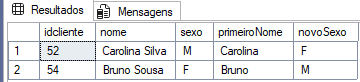

# Corrigir sexo cadastrado incorretamente em clientes no SQL Server

Este projeto apresenta uma forma de corrigir inconsistências no campo "Sexo" da tabela de clientes no SQL Server, inferindo o valor correto a partir da maioria dos registros com o mesmo primeiro nome.


Há um tempo atrás tive um problema no banco de dados em uma empresa: vários clientes tinham sido cadastrados com o sexo incorretamente e só descobriram muito tempo depois.

Exemplo:  
- "Márcio" cadastrado 10 vezes → 8 vezes como "M" e 2 como "F".  
- O algoritmo ajusta os registros destoantes para "M".  

A primeira ideia para resolver o problema foi buscar um banco de nomes com seus respectivos sexos na Internet para substituir os erros mas não encontrei.

Debruçando sobre o problema comecei a pensar no processo de cadastro dos clientes: como saber o que seria correto uma vez que não havia base de comparação ?

Imaginando todo o processo e analisando os registros considerando somente o primeiro nome (desprezando sobrenomes porque são irrelevantes), descobri que os acertos superaram os erros no cadastro (algo provável). Aí bastaria substituir os registros "destoantes" da maioria com o valor da maioria e estaria resolvido.

Ex: Se tenho um Márcio cadastrado 10 vezes e em 08 vezes aparece como "M", alteraria os registros do Márcio com sexo "F" para "M" e pronto.

Assim, criei um script SQL Server que:

1) Cria a tabela Cliente (opcional se já existir no seu banco de dados)
2) Inclui registros de testes (opcional se já existirem registros na tabela Cliente)
3) Uso de uma CTE (Common Table Expression) chamada cteSexo que:
* Extrai o primeiro nome dos clientes.
* Conta ocorrências de cada sexo.
* Identifica registros incoerentes.

No caso dos registros de testes que usei, os dados a serem alterados seriam:



Neste caso, foi identificado que existe uma Carolina com ID 52 que está com sexo "M" quando deveria ser "F" e Bruno com ID 54 com sexo "F" quando deveria ser "M"

5) O Update é feito somente nos registros a serem ajustados

## Script

Para executar, use o seguinte código

```sql
  /* 
-- Cria tabela para testes (opcional)
CREATE TABLE Cliente
(
    IdCliente INT IDENTITY(1,1),
    Nome VARCHAR(250) NOT NULL,
    Sexo CHAR(1),
    CONSTRAINT PK_IdCliente PRIMARY KEY (IdCliente)
);

-- Cria os dados (opcional)
INSERT INTO Cliente (Nome, Sexo) 
VALUES
('João Silva', 'M'),
('Maria Oliveira', 'F'),
('Carlos Souza', 'M'),
('Ana Pereira', 'F'),
('José Santos', 'M'),
('Fernanda Lima', 'F'),
('Paulo Almeida', 'M'),
('Juliana Costa', 'F'),
('Ricardo Rocha', 'M'),
('Camila Martins', 'F'),
('Marcos Fernandes', 'M'),
('Patrícia Ramos', 'F'),
('André Moreira', 'M'),
('Carolina Duarte', 'F'),
('Felipe Nogueira', 'M'),
('Larissa Monteiro', 'F'),
('Rafael Teixeira', 'M'),
('Beatriz Freitas', 'F'),
('Bruno Mendes', 'M'),
('Gabriela Cardoso', 'F'),
('Gustavo Araújo', 'M'),
('Aline Pires', 'F'),
('Lucas Cavalcante', 'M'),
('Bianca Castro', 'F'),
('Diego Rezende', 'M'),
('Renata Gomes', 'F'),
('Thiago Ribeiro', 'M'),
('Daniela Correia', 'F'),
('Leandro Barros', 'M'),
('Vanessa Figueiredo', 'F'),
('Eduardo Cunha', 'M'),
('Simone Brito', 'F'),
('Marcelo Pinheiro', 'M'),
('Isabela Santana', 'F'),
('Rodrigo Carvalho', 'M'),
('Tatiane Macedo', 'F'),
('Fábio Tavares', 'M'),
('Priscila Azevedo', 'F'),
('Alexandre Coelho', 'M'),
('Marina Andrade', 'F'),
('Renato Dias', 'M'),
('Natália Barcellos', 'F'),
('Sérgio Bastos', 'M'),
('Cláudia Antunes', 'F'),
('Pedro Guimarães', 'M'),
('Sabrina Peixoto', 'F'),
('Otávio Silveira', 'M'),
('Letícia Prado', 'F'),
('Mateus Barbosa', 'M'),
('Débora Furtado', 'F'),
('Carolina Silva', 'M'),
('Carolina Sousa', 'F'),
('Bruno Sousa', 'F'),
('Bruno Assunção', 'M'),
('Bruno Almeida', 'M'),
('Brunco Castro', 'M'),
('Débora Furtado', 'F'),
('Carolina Silva', 'M'),
('Carolina Sousa', 'F'),
('Bruno Sousa', 'F'),
('Bruno Assunção', 'M'),
('Bruno Almeida', 'M'),
('Bruno Castro', 'M')

*/

begin transaction
;with cteSexo as
	(select *
	from
	(select idcliente,nome,sexo,
	substring(a.nome,1,charindex(' ',nome)) as primeiroNome,
	(select top 1 sexo
	from
	cliente tmp
	where
	upper(substring(tmp.nome,1,charindex(' ',tmp.nome))) =
    upper(substring(a.nome,1,charindex(' ',a.nome)))
	group by upper(substring(a.nome,1,charindex(' ',nome))), sexo
	order by upper(substring(a.nome,1,charindex(' ',nome))),count(1) desc
	) as novoSexo
	from cliente a) a1
	where
	a1.sexo <> a1.novosexo and
	a1.novosexo is not null)
Update
cliente
Set Sexo = NovoSexo
from
cteSexo tmp
where
cliente.idcliente = tmp.idcliente
-- commit -> se quiser confirmar, descomente (apague o "--")
-- rollback -> se quiser desprezar as alterações (apague o "--")
````

## Ou caso queira testar antes de aplicar (recomendável) execute:
````sql
;with cteSexo as
	(select *
	from
	(select idcliente,nome,sexo,
	substring(a.nome,1,charindex(' ',nome)) as primeiroNome,
	(select top 1 sexo
	from
	cliente tmp
	where
	upper(substring(tmp.nome,1,charindex(' ',tmp.nome))) =
    upper(substring(a.nome,1,charindex(' ',a.nome)))
	group by upper(substring(a.nome,1,charindex(' ',nome))), sexo
	order by upper(substring(a.nome,1,charindex(' ',nome))),count(1) desc
	) as novoSexo
	from cliente a) a1
	where
	a1.sexo <> a1.novosexo and
	a1.novosexo is not null)
Select * from cteSexo;
````

Os testes foram executados no SQL Server 2016 e o desempenho ficou muito bom mesmo se houver milhares de registros

